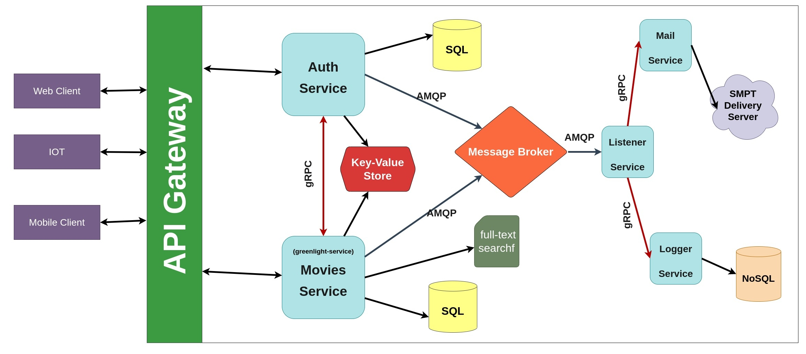
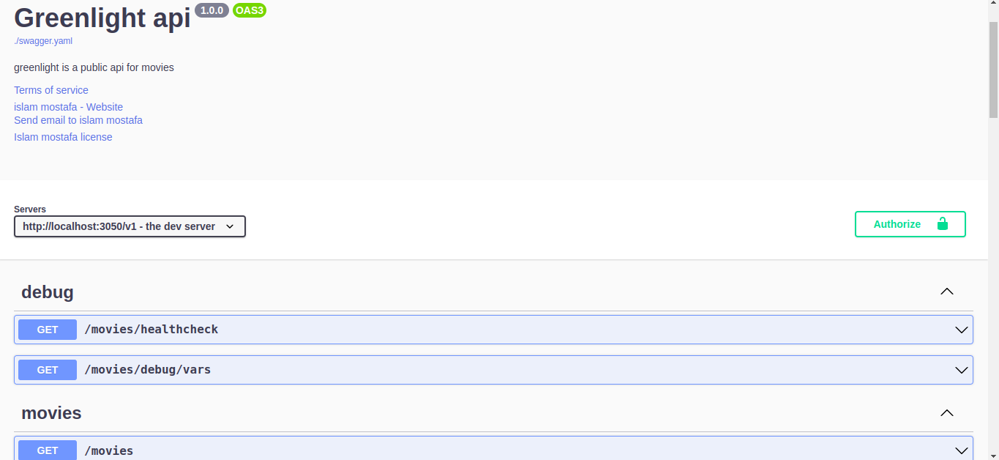
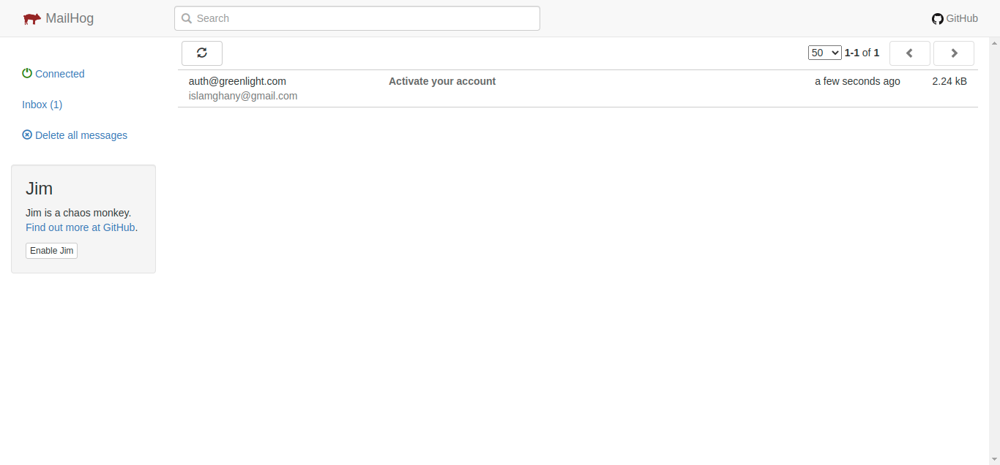

# Microservices project for movies.

This project contains a microservices application written mostly in Go, which will be updated periodically as I learn more about backend engineering, including scalability, security, performance, and best practices in modern system design.

## Architecture overview



[Greenlight client application(still not finished)](https://github.com/islamghany/greenlight-client)

## Tech Stack


 
 
 
 
 
 


## Installation

The installation is very simple the only required thing is to have docker and docker-compose installed on your machine.

First clone the project

```bash
git clone https://github.com/islamghany/greenlight.git
```

then go the project folder in inside greenlight project.

```bash
cd ./greenlight/project
```

then run the docker compose up to generate containers.

```bash
docker compose up
```

to stop the containers hit _Ctrl+C_

to Stop containers and removes containers, networks, volumes, and images created by docker compose up command.

```bash
docker compose down
```

if you made a change in the code and you want to see just rebuild the images with

```bash
docker compose up --build
```

## Usage

After installation, you may want to interact with the project.
So, you can open the swagger API and play with the project APIs through this URL

```bash
http://localhost:3050/v1/swagger/
```



Also if you registered as a user you may want to check the mail through the mail service dashboard, since an activation token
is sent to your registered mail.

you can open the email-testing dashboard through the link

```bash
http://localhost:8025/
```


